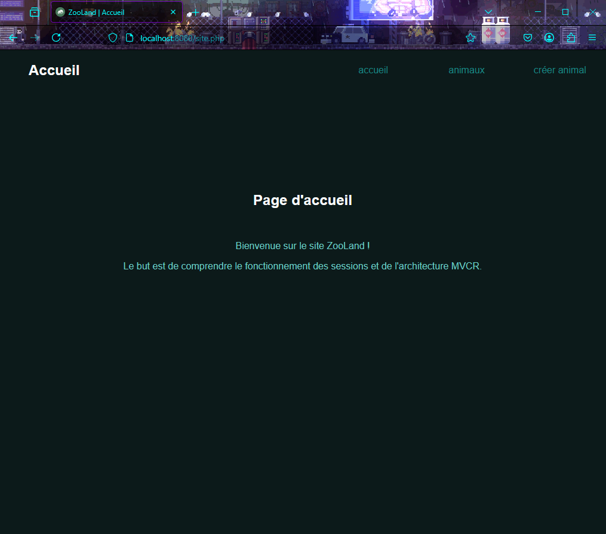
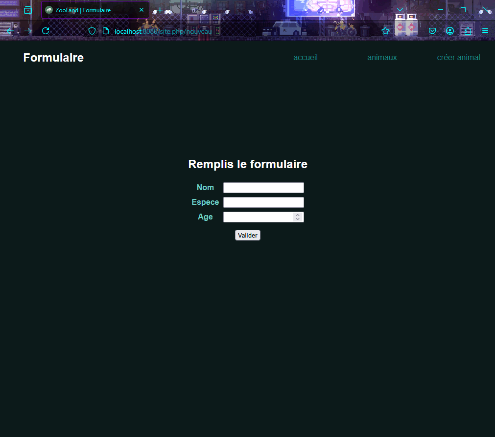

# Site web MVCR

## Description

Site web réalisé avec HTML et CSS pour le front et PHP pour le back. J'ai utilisé l'architecture MVCR (Modèle, Vue, Contrôleur, Routeur).
Le but de ce projet est d'apprendre à maîtriser les bases de l'architecture MVCR et de comprendre le fonctionnement des sessions en PHP.

## Fonctionnalités principales

+ Ajouter des animaux qui seront sauvegardés dans une session.

+ Lire le contenu des informations concernant les animaux.

## Comment lancer le site web

+ Pour démarrer le site en local sous Windows 11, voici les étapes à suivre :
    + Téléchargez et installez la dernière version de [PHP](https://windows.php.net/download/) (non thread safe).
    + Décompressez le paquet .zip et mettez le dossier sur votre lecteur : `C:\`.
    + Dans ce paquet, il faut dupliquer le fichier `php.ini-development` et le renommer `php.ini`.
    + Ouvrez le fichier php.ini et ajoutez la ligne `extension_dir = "ext"`.
    + Décommentez la ligne `extension=openssl` car je l'utilise dans mon projet web.
    + Appuyez sur la touche Windows et recherchez "modifier les variables d'environnement".
    + Un panneau de configuration s'ouvre, suivez les instructions ici : Variables d'environnement > Variables système > Path > Modifier.
    + Ajoutez l'emplacement de votre dossier PHP `C:\nomdupaquetphp`.
    + À la racine du projet web, ouvrez un CMD (terminal) et tapez la commande `php -S localhost:8080`.
    + Ouvrir un navigateur web et aller à l'url `localhost:8080/site.php`.

+ Démarrer le site en local sous Linux (ex: Ubuntu) :
    + Mettez à jour la liste des paquets et les paquets installés sur votre système avec `sudo apt update && sudo apt upgrade`.
    + Installez php avec `sudo apt install php php-cli php-mbstring `.
    + À la racine du projet web, ouvrez un terminal et tapez la commande `php -S localhost:8080`.
    + Ouvrir un navigateur web et aller à l'url `localhost:8080/site.php`.

Il est également possible de démarrer le site web via un serveur HTTP/HTTPS comme [Apache2](https://httpd.apache.org/docs/).

## Contribuer

+ N'hésitez pas à signaler des bugs.

+ N'hésitez pas à améliorer le code existant.

## Licence

Ce projet est sous licence [MIT](./LICENSE.md).

## Captures d'écran

## Crédits des images

Icone du site conçu par [www.freepik.com](https://fr.freepik.com/).

